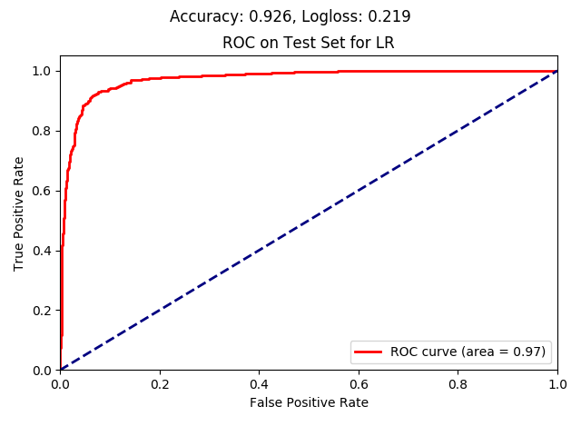
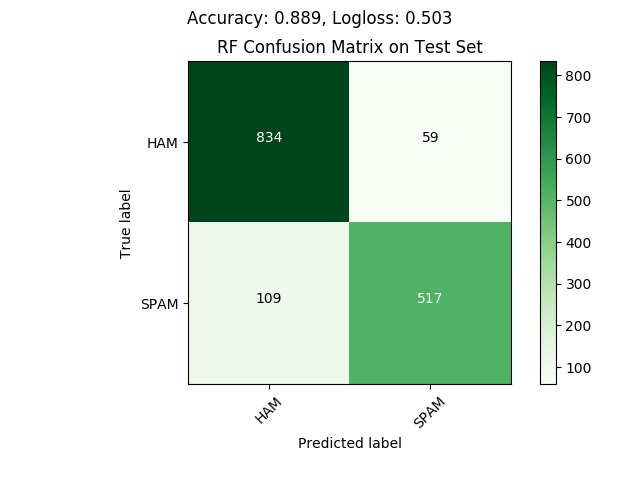
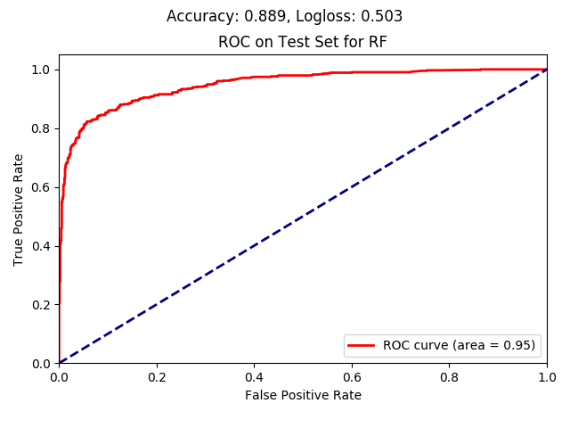
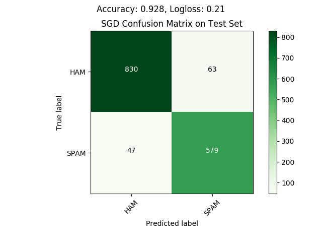
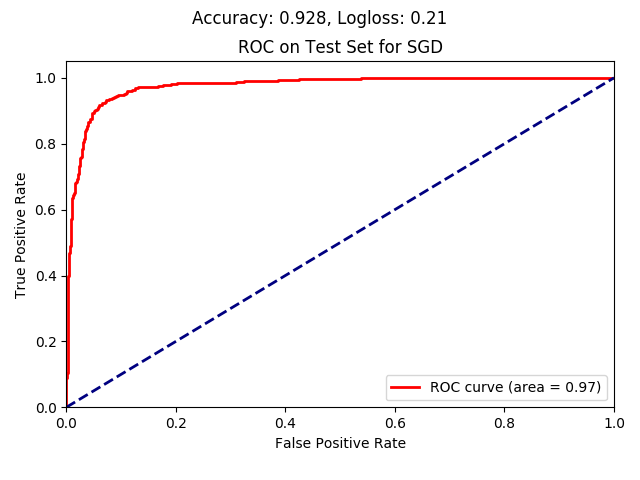
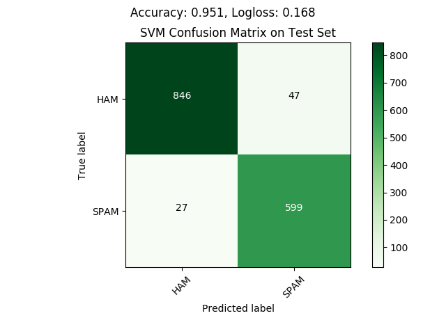
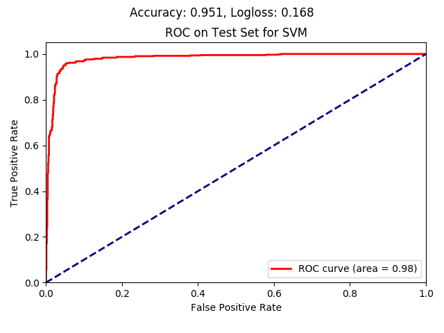

# SpamHam Classification & Refactoring Decimal Numbers
_Using Python3.6_

## Spam or Ham?

#### Process:
In order to run the spam ham classification run the spamHam.py file. You may need to change the data filepaths by setting relevant environment variables (see config.py).

1. We first examine our data by looking at the number of missing values per column (there were none), and their basic statistics (can be seen in the logs).
2. We standardise the data using minMax scaling and subsequently engineer some new features that may help mitigate skewness in our features' distributions. Specifically we derive the log for some of the columns and add the new columns to our feature set.
3. We split our data into training (~70%) and testing (~30%) features and labels.
4. We use our training set and a randomised parameter grid search to train 4 binary classification models with cross-validation: 
    - a random forest (RF),
    - a support vector machine (SVM), 
    - a logistic regression (LR) &
    - a regularised logistic regression (SGD) [here we want to use classifier equivalent to the elasticnet for regression problems]
    
    During the 5fold-cross-validation for each of the listed classifiers, a range of hyperparameters is tested greedily (specified per model in config.py). This is
    done over 5 training-validation further splits of the training set and the best resulting model (as evaluated on the validation set) is selected per classifier, based on the average LogLoss score.
    At the end of the cross-validation circle the best model's parameter values are used and the best performing model is saved per classifier. In the logs, apart from the LogLoss, the accuracy and precision/recall are reported over both the training and validation sets.
    
    By comparing the training set results to the validation/test set results we can understand if overfitting is a problem for our models, hence the availability of training set scores.

5. Finally, we use our 4 trained classifiers to evaluate the models on the original testing set. 
We evaluate the accuracy & LogLoss on both the training and testing data, for the reason explained above, but we also examine the resulting confusion matrix and ROC-AUC curve on the testing set and visualise them. 
The generated plots can be seen below.

#### Results:
Below we can see the results of the four classifiers and their performances on the testing data. Their training data performance is logged during runtime.

*Logistic Regression*

In the above charts we can see that the main type of error made by the LR classifier is that of falsely classifying ham emails as spam (25% more frequently than missing to identify spam emails).
 That is not ideal as it would mean that we may miss significant emails at times. The accuracy, however is quite good, and the loss relatively low, indicating that in most cases the predicted probability is close to its correct value
 (i.e. that most the model is confident over most predictions). The results on the training set were similar, indicating that overfitting did not pose an issue in this case (Accuracy: 0.929, LogLoss: 0.212).

*Random Forest*

Surprisingly, the RF classifier performs a little worse than the LR, perhaps because the classes are linearly separable. The following 2 reasons may be contributing to this observation:
1. The hyperparameter "number of trees" may have needed further exploration & tuning.
2. Most of the variables are not highly correlated, so the trees composing the RF model cannot benefit from the entirety of the information in the data.
While this is reflected in the less steep ROC-AUC curve of the RF, it is clear that in this case most errors are classifying spam emails as ham, which is more to our liking. Similarly for the RF, overfitting was not observed (Accuracy: 0.898, LogLoss: 0.500).

*Stochastic Gradient Descent*

  

SGD, seen above, seem to perform marginally better than the LR classifier with a testing set score of 0.928 and a loss of 0.210 and no overfitting. 
Yet, as with LR, the improvement comes from incorrectly identifying fewer spam as ham, rather than the opposite.

*Support Vector Machine*

  

Last but not least, the SVM seems to perform the best, with an accuracy of 0.953 on the training set and 0.951 on the testing set (and a logloss of 0.148 & 0.168 respectively). 
Moreover, only ~1/3 of the errors is due to misclassifying ham emails as spam ones, which is in line with our goal.   

It is, therefore, clear that the SVM is the best performing model for the above task.

## Refactoring Decimal Numbers

To run this program, run the refactorDecimalsToFractions.py file and follow the instructions. 
Relevant tests can be found under the test directory of this repository and are can be run with the pytest module. 
