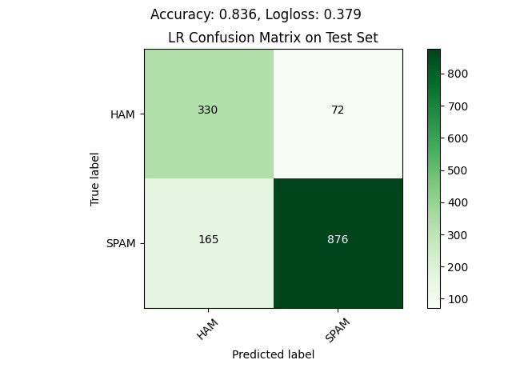
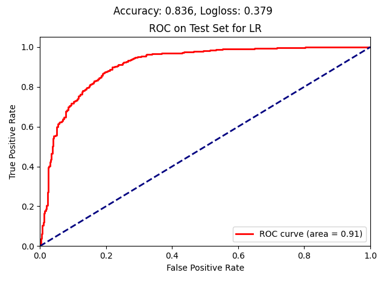
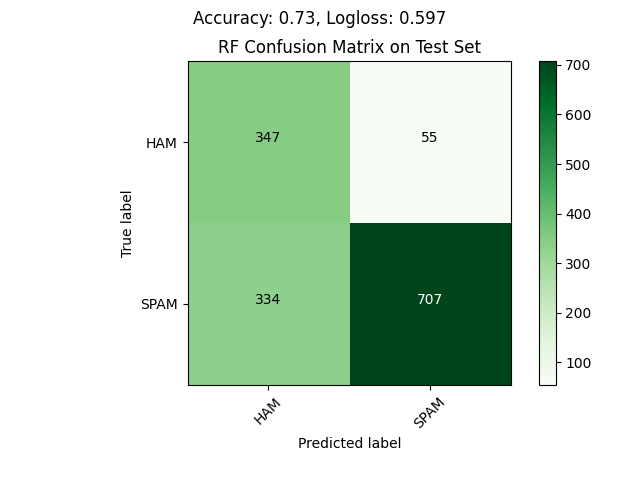
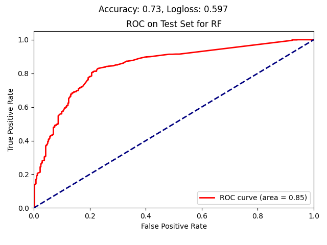
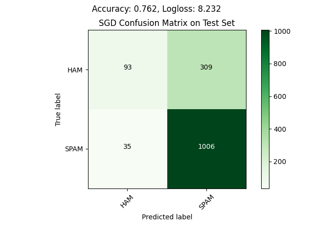
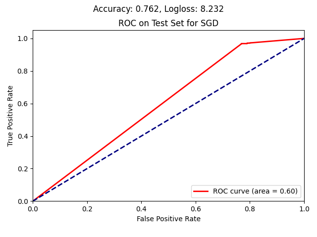
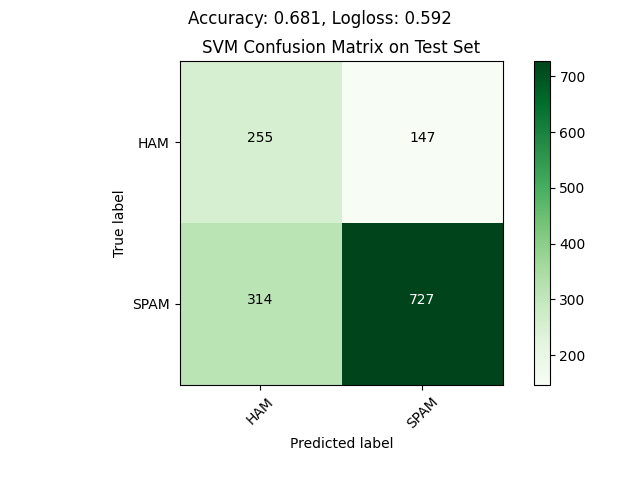
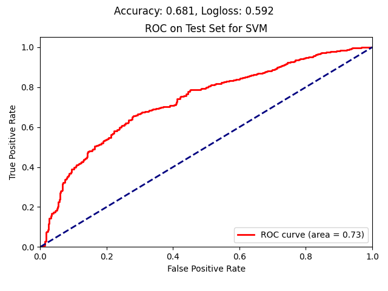

# SpamHam Classification
_Using Python3.8_

## Spam or Ham?

#### Process:
In order to run the spam ham classification run the spamHam.py file. You may need to change the data filepaths by setting relevant environment variables (see config.py).

*We do not deploy Deep learning here, although a Bert based model would work great for this task and most likely result in better performance. The reason is that we want to showcase things such as feature engineering & model selection (as well as time constraints).*
1. We first examine our data by looking at the number of missing values per column (there ere none), and their basic statistics (can be seen in the logs).
2. We standardise the text by:
    - converting it to lowercase and removing unnecessary spaces
    - tokenizing it
    - removing stopwords
    - lemmatizing the remaining words
    - we do not remove punctuation as there is a possibility it may be informative to our goal 
3. We engineer new features by extracting and counting:
    - total tokens in the text
    - different POS tags
    - number of emojis
    - number of punctuation marks
    - number of stopwords used in text
    We also create TfIdf vectors for the preprocessed text and combine them with our engineered features. We use the 300 most frequent terms across the corpus for that, ignoring the top 5% of frequent terms that could be thought of as context specific stopwords.
4. Our data is already split by training, testing and validation. We combine the training and validation sets as we will perform cross validation using the builtin functionality for partitioning the dataset.
5. We use our training set and a randomised parameter grid search to train 4 binary classification models with cross-validation: 
    - a random forest (RF),
    - a support vector machine (SVM), 
    - a logistic regression (LR) &
    - a regularised logistic regression (SGD)
    
    During the 5fold-cross-validation for each of the listed classifiers, a range of hyperparameters is tested greedily (specified per model in config.py). This is
    done over 5 training-validation further splits of the training set and the best resulting model (as evaluated on the validation set) is selected per classifier, based on the average LogLoss score.
    At the end of the cross-validation circle the best model's parameter values are used and the best performing model is saved per classifier. In the logs, apart from the LogLoss, the accuracy and precision/recall are reported over both the training and validation sets.
    
    By comparing the training set results to the validation/test set results we can understand if overfitting is a problem for our models, hence the availability of training set scores.

5. Finally, we use our 4 trained classifiers to evaluate the models on the original testing set. 
We evaluate the accuracy & LogLoss on both the training and testing data, for the reason explained above, but we also examine the resulting confusion matrix and ROC-AUC curve on the testing set and visualise them. 
The generated plots can be seen below.

**It is important to note that there is a severe class imbalance problem here (we have 5246 spam and 1898 ham messages in total). More importantly the imbalance affects the negative class mainly, which is unusual. For this we tried inverting the problem to predict for ham rather than spam, but there was no significant improvement. We avoided manually balancing the data, as that would result in information loss.**
**In the end we ended up using balanced class weights during training to mitigate the above issue.**

#### Results:
Below we can see the results of the four classifiers and their performances on the testing data. Their training data performance is logged during runtime.

*Logistic Regression*

In the above charts we can see that the main type of error made by the LR classifier is that of falsely classifying spam emails as ham, while the inverse error is actually not very common. It manages to classify about 50% of ham emails correctly as well as 84% of spam emails. Only 18% of ham emails are classified as spam.
 That is not ideal as it would mean that we may miss significant emails at times, but it is not too bad either. The accuracy, however is quite good. The results on the training set were similar, indicating that overfitting did not pose an issue in this case.

*Random Forest*

Surprisingly, the RF classifier performs somewhat worse than the LR (in terms of accuracy it is 10% lower, at 73%), perhaps because the classes are linearly separable. The following 2 reasons may be contributing to this observation:
1. The hyperparameter "number of trees" may have needed further exploration & tuning.
2. Most of the variables are not highly correlated, so the trees composing the RF model cannot benefit from the entirety of the information in the data.
While this is reflected in the slightly less steep ROC-AUC curve of the RF, it is clear that in this case most errors are classifying spam emails as ham, which is more to our liking. Similarly for the RF, overfitting was not observed.

*Stochastic Gradient Descent*

  

SGD, seen above, seem to perform much worse than the above, clearly favoring the most abundant class of spam emails. 
It struggles correctly identifying ham emails, which means users would miss out on potentially relevant or even important information! 

*Support Vector Machine*

  

Last but not least, the SVM seems to be better at identifying spam emails compared to the RF model, but its ability to correctly identify ham emails is not half as good as that of RF or even LR. 
It is however much better at identifying ham emails than the SGD model.

**It is, therefore, clear that while the LR has the best overall scores, the best model for this task is the RF.**

## Putting it in Production

- The code is exposed as an async API that receives text in json format and returns the predicted probability. Different subsequent uses may determine different thresholds for assigning a positive or negative class to the text, so that is not returned (in this context the threshold is 0.5).
- The API would be productionized as a Docker container. It could be an ECS task with autoscaling to handle concurrency better. 

- Relevant unit-tests can be found under the test directory of this repository and are can be run with the pytest module (they are just for a single function and serve as an example). They are not run within the Docker container, but would most likely be run via the deployment pipeline.
